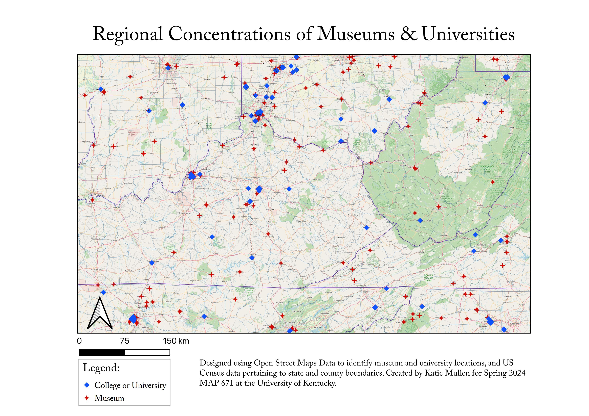

# Spring 2024 Final Project: Museums-and-Universities

## Project Contents

- [Data Source](#data-source)
- [Project Background](#project-background)
- [Methodology](#methodology)

***

### Data Source
This map was made in QGIS by importing state and county lines and data from the United States Census information, and querying museums and cultural institutions and colleges and universities through open street maps.

<a href="https://www.census.gov/cgi-bin/geo/shapefiles/index.php?year=2023&layergroup=Counties+%28and+equivalent%29" target="_blank">Link to US Census Data Source</a>

<a href="https://www.openstreetmap.org/#map=5/34.904/-115.159" target="_blank">Link to Open Street Maps</a>

Map Projection:

* Initial "Museum" OSM projection: EPSG 4269
* Initial "University" OSM projection: EPSG 4326
* Final Map projection: EPSG 3857/ Wgs 84/Pseudo Mercator
* Scale: 1:518338
* Center coordinates:-9314139, 4601813

### Project Background

I chose to complete these queries after reading The Injustice of Place (2023, Edin, Nelson, Shaefer), which identified several parts the appalachian region in Kentucky and West Virginia as some of the most deeply disadvantaged places in the US (in addition to parts of the Mississippi delta and southern Texas) due to their histories of internal-colonization and resource extraction. Considering the disparities of wealth and resources in those communities, I was curious to see where cultural institutions and educational resources existed in and surrounding some of the most economically disadvantaged places in the US. 

### Purpose

I created this map to visually communicate the concentration of educational and cultural institutions in and around the most economically distressed area of the appalachian region (eastern Kentucky and western West Virginia, per the Appalachian Regional Commission, or ARC).

I attempted to find enconomic data to incorporate into my map, to better demonstrate the relationship. I was not able to access open-source data specific to counties within this region, however, I suggest looking at the ARC's <a href="https://www.arc.gov/classifying-economic-distress-in-appalachian-counties/" target="_blank">Classifying Economic Distress in Appalachian Counties</a>

### Mapmaking Process

For this assignment, I imported OSM and US Census Data. I added state boundaries and removed fill. I adjusted the color and weight of the line stroke to increase its visibility, to make the state boundaries more apparent. I then added the county boundaries and names, so the viewer could zoom in to identify specific locations. 

Next, I added my data pertaining to museums and universities/colleges. I selected a specific region of the US, including and surrounding the heart of the appalachian region. Then, using the canvas extent to constrain my search, I ran two querries on the area: museums and universities. I adjusted the graphic representation of the points to increase their visibility, by assigning them unique shapes (square and star) and higher contrast colors (red and blue).

### Map summary

From this map, it is apparent that areas within this region that have more access to higher education are more likely to have greater access to cultural institutions. Access to these resources is particularly dense in southern Ohio, around Cincinatti. In Lexington and Louisville, there are fewer institutions than I would expect in comparison to Cincinnati. I wonder if this is an effect of biases in map data collection for OSM, since there in a predominant German history in Cincinnati, and I noted from an earlier module that the primary demographic inputting data into OSM is german males.

Through the process of creating this map, I have identified additional questions I would be curious about answering through mapping. I am curious to find the distances between specific areas in eastern Kentucky and the closest museums/universities. I would also be curious about the size and scale of those institutions. I would be curious about what other cultural institutions are mapped, and how those relate to this map. Finally, I would be curious to see a map of National Endowment for the Arts grants, since much of that funding is meant to bring accessibility to the arts in areas where it is otherwise unaccessible.

## Final Project Link

Please view the [final map online](www.github...)
